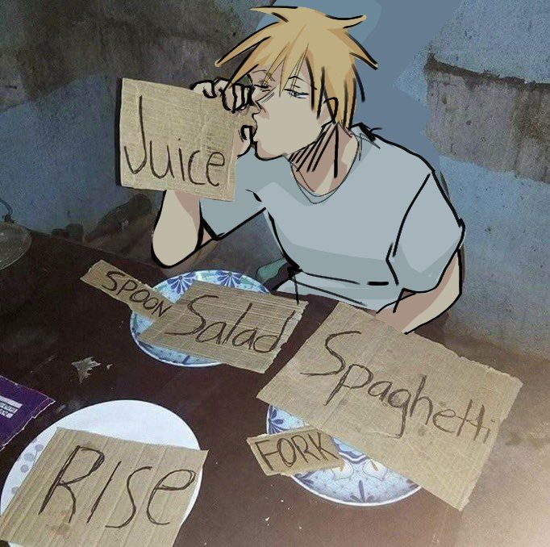

# It's me, Daniel

### websites, games, and other things that seemed like a good idea

 

`Building` &nbsp; `Learning` &nbsp; `Occasionally Debugging`

---

## About me

I'm a second-year student at the **University of Ottawa**, currently preparing and searching for junior-level and second-year co-op opportunities.

I'm mainly interested in **web development**, **game development**, and **hardware programming**. I prefer learning by making things, even if those things remain unfinished for a suspicious amount of time.

Right now, I'm working on private websites and a few Roblox games that aren't quite ready to escape into the public yet.

---

## Things I use

  
  &nbsp;
  
  &nbsp;
  
  &nbsp;
  
  &nbsp;
  

---

## Current projects

### Websites

I'm working on a few websites that aren't publicly available yet. I'll add them here once they're ready to be seen by people other than me.

### Roblox games

A collection of unfinished game ideas, experiments, and mechanics. Some may eventually become complete games. Statistically, at least one should.

---

## Outside of programming

  
When I'm not staring at code, I'm probably:

- at the gym
- listening to music
- meal prepping
- playing games
- studying at the library
- watching anime

I like *Chainsaw Man* a normal and reasonable amount.

---

## Current status

Broke and single

---

## Contact

  
  &nbsp;
  
  &nbsp;
  
  &nbsp;
  
  &nbsp;
  

---

### `THE END`

stay curious · keep building · hire me pls

